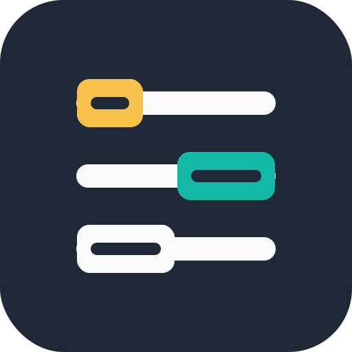

<div align="center">
  
  <p>
    <b>Slotline — private scheduling with public availability counts</b>
  </p>
</div>

Slotline is a self-hostable scheduling app for teams. Poll creators sign in with
OIDC, participants answer from a public link, and everyone can see availability
counts without exposing participant names or full responses.

## Features

- OIDC login for poll creators.
- Anonymous voting by poll link.
- Public availability counts per time slot.
- Full participant responses visible to the poll owner/admin.
- Group polls and one-on-one polls.
- MongoDB storage.
- Docker and Docker Compose support.
- GitHub Actions workflow to build and publish a Docker image to GHCR.

## Access model

- Anonymous visitors can open a poll link and vote.
- Anonymous visitors can see slot counts, but not participant names.
- Anonymous visitors cannot create polls.
- Authenticated users can create polls.
- Authenticated users can view their own polls from **My polls**.
- Poll owners can view full results and finalize a time.

## Configuration

Copy the example environment file:

```sh
cp .env.example .env
```

Required local values:

```env
NEXT_PUBLIC_BASE_URL=http://localhost:3000
NEXT_PUBLIC_ENCRYPTION_KEY=<32-character-value>
NEXT_PUBLIC_ENCRYPTION_IV=<16-character-value>

NEXTAUTH_URL=http://localhost:3000
NEXTAUTH_SECRET=<random-secret>

OIDC_ISSUER=https://auth.example.com/realms/example
OIDC_CLIENT_ID=slotline
OIDC_CLIENT_SECRET=<client-secret-if-required>
OIDC_PROVIDER_NAME=OIDC
```

Generate encryption values:

```sh
openssl rand -hex 16
openssl rand -hex 8
```

Generate a NextAuth secret:

```sh
openssl rand -base64 32
```

For Keycloak or another OIDC provider, configure the redirect URI:

```text
http://localhost:3000/api/auth/callback/oidc
```

## Run with Docker Compose

```sh
docker compose up --build
```

The app is available at:

```text
http://localhost:3000
```

Stop the stack:

```sh
docker compose down
```

Remove local MongoDB data as well:

```sh
docker compose down --volumes
```

## Development

Install dependencies:

```sh
npm install
```

Run the development server:

```sh
npm run dev
```

Run TypeScript checks:

```sh
npx tsc --noEmit
```

Build:

```sh
npm run build
```

## Docker Image

The GitHub Actions workflow publishes images to GHCR:

```text
ghcr.io/<owner>/<repo>
```

Tags include:

- `main`
- `sha-<commit>`
- semantic version tags such as `1.0.0` when pushing `v1.0.0`

Configure these GitHub repository values before using the workflow:

- Variable: `NEXT_PUBLIC_BASE_URL`
- Secret: `NEXT_PUBLIC_ENCRYPTION_KEY`
- Secret: `NEXT_PUBLIC_ENCRYPTION_IV`

Runtime-only values such as `NEXTAUTH_SECRET`, `OIDC_CLIENT_SECRET`, and
`NEXT_MONGODB_URI` should be provided by the environment where the container
runs.

## Origins

Slotline is based on the open source Samay scheduling project.

## License

This project is distributed under the MIT License.
